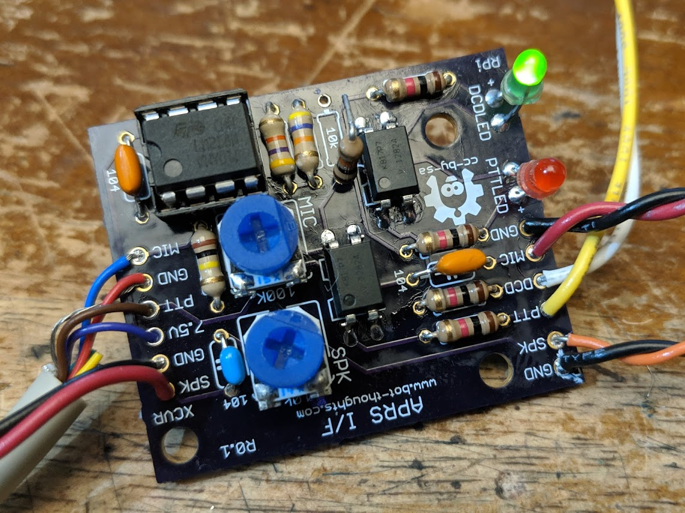
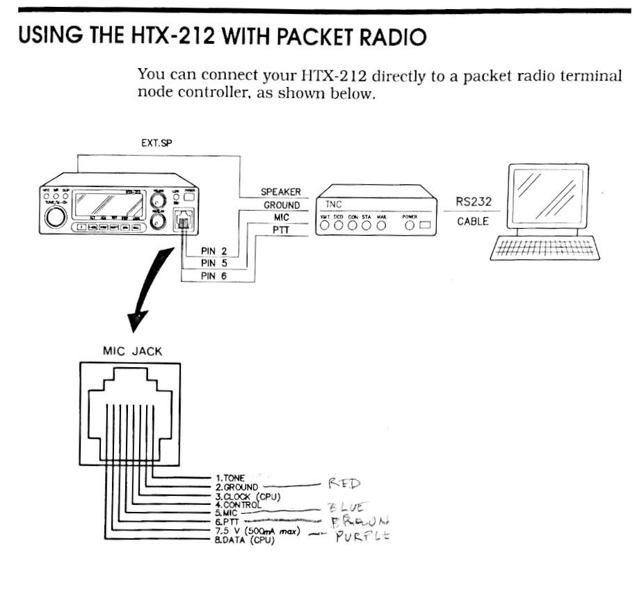

# Raspberry Pi APRS Interface Board

This board is designed to inteface a 2M ham radio with a Raspberry Pi running APRS software such as 
[direwolf](https://github.com/wb2osz/direwolf). Features DCD (Data Carrier Detect) and PTT (Push-To-Talk) GPIO and indicator 
LEDs.

I built this board for use with a Radio Shack HTX-212 I picked up cheap at a hamfest.

# HTX-212 Pinout

On the "XCVR" side of the board, solder jumper wires into wire pads labeled SPK/GND, and solder the other ends to a 3.5mm 
audio jack. Use a 3.5mm audio cable (mono is fine) to connext the radio's external speaker to this SPK jack. Use an RJ45 mic 
cable in the Mic jack of the radio and connect the 5V, PTT, MIC, and GND wire pads to the appropriate wires per the pinout 
image above.

# Raspberry Pi Hookup

You'll need an audio board with mic and speaker/headphone jack(s). You can either use a USB audio board or one that plugs 
into the RPi GPIO pins like these:

 * [Adafruit I2S Audio Bonnet](https://www.adafruit.com/product/4037?gclid=CjwKCAjwwZrmBRA7EiwA4iMzBJIsz_BS15PQMNVDndOI5iDkNbGunKcJ2TeuTTbweKNQdpY2VGxX5RoCWLQQAvD_BwE)
 * [Fe-Pi Audio Z (V2)](https://pinout.xyz/pinout/fe_pi_audio_z_v2)

Using jumper wire soldered into wire pads on the "RPi" side of the board, connect the MIC/GND to an 3.5mm audio jack, connect 
SPK/GND to another 3.5mm audio jack. Use two 3.5mm audio cables to connect to your audio board as follows. MIC goes to RPi 
mic jack. SPK goes to RPi external speaker jack. Then, solder jumper wire to the DCD and PTT wire pads, and connect to 
active high pins on the Raspberry Pi. I use GPIO17 and GPIO27. Ground is provided through the audio cables

